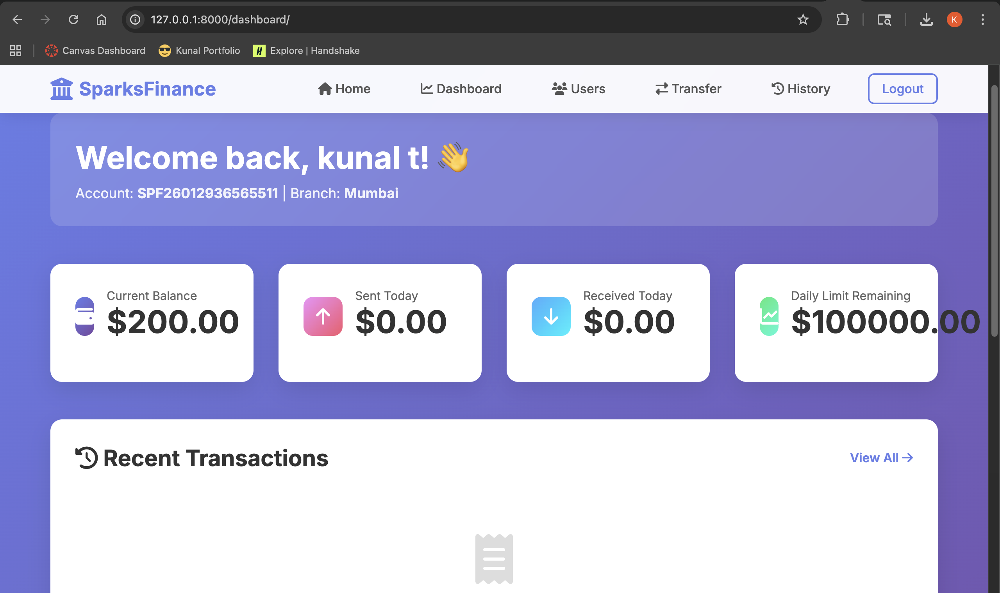
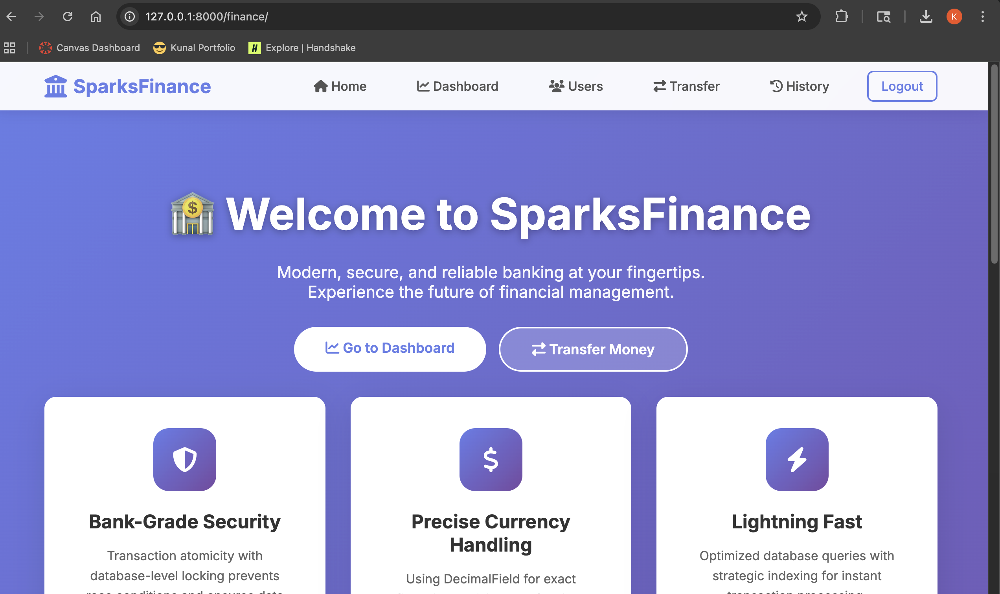

# SparksFinance

A secure banking application built with Django that handles money transfers between users with proper transaction safety.

## Screenshots

### Dashboard


### Homepage


## Features

- User authentication and registration
- Account management with unique account numbers
- Secure money transfers between accounts
- Transaction history with filtering
- Daily transfer limits
- Real-time balance tracking
- Admin panel for management

## Tech Stack

- **Backend**: Django 4.2, Python 3.12
- **Database**: SQLite (dev), PostgreSQL (production)
- **Frontend**: HTML, CSS, JavaScript
- **Testing**: pytest (82% coverage)
- **Deployment**: Docker

## Quick Start

```bash
# Clone and setup
git clone https://github.com/yourusername/SparksFinance.git
cd SparksFinance

# Create virtual environment
python3 -m venv venv
source venv/bin/activate  # On Windows: venv\Scripts\activate

# Install dependencies
pip install Django==4.2.7

# Setup database
python manage.py migrate

# Create admin user
python manage.py createsuperuser

# Run server
python manage.py runserver
```

Visit http://localhost:8000/finance/

## Key Implementation Details

### Transaction Safety
Used `@transaction.atomic` with `select_for_update()` to prevent race conditions:

```python
@transaction.atomic
def transfer_money(sender, receiver, amount):
    sender = BankAccount.objects.select_for_update().get(pk=sender.pk)
    receiver = BankAccount.objects.select_for_update().get(pk=receiver.pk)
    
    if sender.balance < amount:
        return False, "Insufficient balance"
    
    sender.balance -= amount
    receiver.balance += amount
    sender.save()
    receiver.save()
```

This ensures that concurrent transfers don't cause data corruption.

### Currency Handling
Used `DecimalField` instead of `FloatField` for precise financial calculations:

```python
balance = models.DecimalField(max_digits=12, decimal_places=2)
```

Avoids floating-point precision errors that are unacceptable in banking.

### Architecture
Separated business logic into services layer for better testing and maintainability:
- `TransactionService` - Handles money transfers
- `AccountService` - Account management operations
- `AuditService` - Activity logging

## Testing

Run tests:
```bash
python manage.py test finance
```

Current coverage: 82%

Tests include:
- Unit tests for models and services
- Integration tests for views
- Concurrency tests (using threading to test race conditions)
- Form validation tests

## Configuration

Create a `.env` file:
```env
DJANGO_SECRET_KEY=your-secret-key
DJANGO_DEBUG=True
DJANGO_ALLOWED_HOSTS=localhost,127.0.0.1
```

## Docker

```bash
docker-compose up -d
docker-compose exec web python manage.py migrate
docker-compose exec web python manage.py createsuperuser
```

## Security

- Environment variables for secrets
- CSRF protection on all forms
- Input validation at multiple levels
- Authentication required for sensitive operations
- Audit logging for all transactions
- Password hashing with PBKDF2

## Admin Panel

Access at http://localhost:8000/admin/

Default credentials (change immediately):
- Username: admin
- Password: (set during createsuperuser)

## Project Structure

```
SparksFinance/
├── finance/
│   ├── models.py          # BankAccount, Transaction, AuditLog models
│   ├── views.py           # Request handlers
│   ├── services.py        # Business logic
│   ├── forms.py           # Form validation
│   ├── tests.py           # Test suite
│   └── templates/         # HTML templates
├── SparksFinance/
│   └── settings.py        # Django configuration
├── manage.py
├── requirements.txt
└── docker-compose.yml
```

## What I Learned

- Handling concurrent database operations safely
- Importance of using proper data types (Decimal vs Float for currency)
- Service layer pattern for clean architecture
- Writing tests for race conditions
- Django ORM optimization with select_related

## Known Issues

- None currently

## Future Improvements

- Add email notifications
- Implement 2FA
- Add transaction categories
- Build REST API endpoints
- Add data export functionality

## Contributing

Pull requests are welcome. For major changes, please open an issue first.

## License

MIT

## Contact

Kunal Sachin Takke - [LinkedIn](https://linkedin.com/in/kunalsachintakke) 

Project Link: [https://github.com/kunalsachintakke/SparksFinance](https://github.com/kunalsachintakke/SparksFinance)
